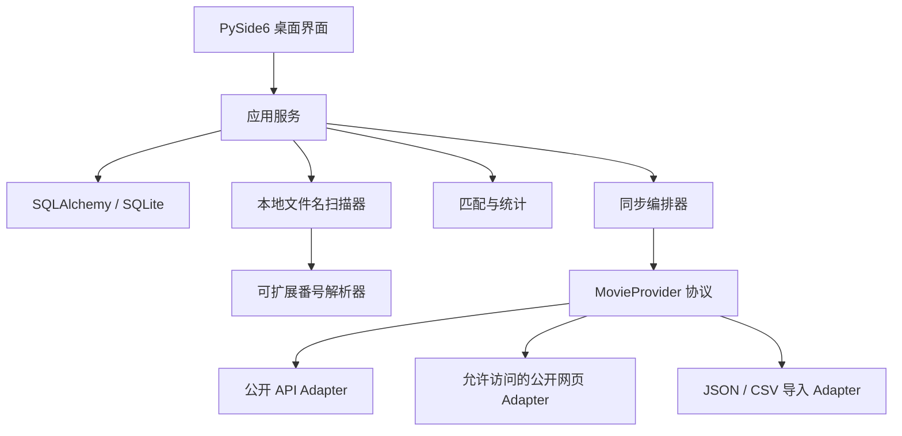

# 本地作品库：设计与分阶段计划

> 当前进展：Phase 1–6 的本地功能已实现。用户已将扫描范围调整为“只扫描视频文件名”；以下 Phase 1 初稿中的文件大小/文件时间/ffprobe 规划已取消。当前执行规范见 [Phase 2 说明](phase2.md)、[Phase 3 说明](phase3.md)、[Phase 4 说明](phase4.md)、[Phase 5/6 说明](phase5-6.md)，实际数据库使用 migrations.py 的 v1→v4 增量迁移。

## 1. 需求边界与技术选择

目标是在个人 Windows 电脑上把“已收录的真实作品集合”和“已扫描到的本地文件集合”对照，回答已收藏、缺少、最新作品和完成度。无下载、资源搜索、播放、账号和云同步。

采用 Python 3.11+、PySide6 Qt Widgets、SQLAlchemy 2、SQLite。一个语言栈同时承担桌面界面、文件扫描、元数据适配和数据库，避免额外的浏览器运行时、前后端通信及 Rust 工具链。个人维护成本优先于网页式动效。后续 Windows 打包在 Phase 6 评估 PyInstaller；当前通过虚拟环境启动。

技术依据：[Qt for Python 官方文档](https://doc.qt.io/qtforpython-6/)、[SQLAlchemy SQLite 文档](https://docs.sqlalchemy.org/en/20/dialects/sqlite.html)。SQLite 每次连接开启外键，迁移使用显式事务；当前采用默认 rollback journal，保留单写入进程。若后续启用 WAL，备份必须同时考虑 checkpoint 与 SQLite backup API。

### 正确性约定

- “作品总数”是已收录数量，不宣称任何单一来源覆盖全部发行史。显示来源、覆盖范围、最近成功同步和分页完成状态。
- 来源返回空结果、网络错误和扫描失败不等于作品/文件消失。仅完整成功的扫描才能标记该扫描范围内旧文件已失效。
- 同名女优不自动合并。先通过来源外部 ID 和日文名/别名确认身份，再绑定来源；Phase 1 常用名唯一，同名可用区分名称。
- 作品以标准番号作为主要匹配键，多人作品采用多对多关联，不为每位女优复制作品。
- 不根据连续数字推断作品。忽略状态按“女优—作品”保存，避免影响其他女优的收藏目标。
- 扫描不修改、移动或删除视频。文件系统改动仅限软件自身的数据和缓存目录。
- Phase 1 完全离线；Phase 3 起仅向用户启用的来源发送检索信息，不发送本地目录、文件名或视频内容。
- 封面/头像是可选项；Phase 1 头像仅引用本地图片，源图片移动后回退为姓名占位。

## 2. 分层架构



UI 不写 SQL，也不依赖具体网站。服务管理事务与规则，Provider 只返回统一 DTO，不直接写库。Phase 2/3 的扫描、网络与 ffprobe 放在 Qt 后台工作线程，使用取消信号、进度消息和每线程独立 Session；数据库写入由单独服务串行化。Phase 1 仅有小规模资料 CRUD，使用短事务。

## 3. SQLite Schema

完整目标 DDL 见 [schema-target.sql](schema-target.sql)。它是设计快照，**不是当前数据库迁移脚本**。实际 Phase 1 只创建 `actresses`、`settings`、`schema_migrations`，后续阶段通过新增版本迁移扩展，不能直接对用户库执行目标 DDL。

| 表 | 核心字段 / 约束 | 阶段 |
|---|---|---|
| actresses | id、常用名、日文名、别名 JSON、目录、头像、创建/资料更新/同步/扫描时间 | 1 |
| settings | key 唯一、value JSON；扫描扩展名、递归、ffprobe、更新频率等 | 1 起 |
| schema_migrations | version、applied_at；版本只递增 | 1 |
| scan_history | actress_id、根目录快照、递归范围、状态、起止时间、错误 | 2 |
| local_files | actress_id、原始/规范路径、文件大小/时间、解析结果、探测结果、有效性 | 2 |
| providers | 来源 ID、名称、启用状态、非敏感配置 JSON | 3 |
| actress_sources | actress_id、provider_id、external_id；绑定经确认的来源身份 | 3 |
| movies | 全局作品、namespace + code 唯一、标题、日期、厂商、系列、URL | 3 |
| actress_movies | actress_id + movie_id 联合主键、忽略状态、首次发现时间 | 3/4 |
| movie_sources | movie_id、provider_id、external_id、来源详情和字段快照 | 3 |
| sync_history | 本次来源/女优、成功/部分/失败、分页、数量与时间 | 3 |
| sync_items | sync_id + movie_id、本次新增关联与变更，用于新作品提示 | 3/4 |
| movie_matches | local_file_id 唯一、movie_id、匹配方式、时间 | 4 |

实际 `actresses` 的 `name_key` 使用 NFKC + casefold 防止大小写/全半角重复；`folder_key` 使用平台路径规范化并唯一。同一路径不可分配给两个女优；嵌套路径暂允许，Phase 2 检测重叠并提示扫描范围。路径不做中文兼容归一化，因为不同文件名可能实际指向不同文件。

`movies` 不直接存 actress_id、本地存在、文件路径和收藏计数：这些通过关联和视图得到，避免重复状态漂移。一个作品可关联多个本地文件；一个本地文件在 MVP 中只对应一部作品，多作品合集转人工处理。来自多个来源的同番号归并；相同番号但厂商、日期或版本严重冲突时进入冲突队列，不盲目覆盖。namespace 默认为 jp_standard，特殊编号使用独立命名空间。

所有时间戳按 UTC 保存；发行日期是来源提供的日期，不做时区偏移。界面时间使用本地时区。未知日期为 NULL，不能补成今天或 1970 年。统计与状态通过查询实时计算，后续确有性能需求再缓存。

## 4. 项目结构

```text
src/av_library/
  app.py                  # QApplication、数据路径、进程锁和组装
  config.py               # 数据目录策略
  db/
    database.py           # Engine、外键、事务和 Session
    migrations.py         # 已实现的增量版本
    models.py             # 当前 ORM 实体
  services/
    actresses.py          # 当前资料 CRUD 与输入校验
  ui/
    main_window.py        # 女优列表、详情、搜索和动作
    actress_dialog.py     # 添加/编辑表单和目录选择器
    theme.py              # 统一样式
  providers/
    contracts.py          # DTO 与协议；暂无网络实现
tests/                    # 持久化、回滚和离屏 UI 测试
docs/
  architecture.md
  schema-target.sql
```

后续按阶段新增 `scanner/`、`parsing/`、`matching/`、`services/sync.py`、`providers/<source>.py`、`cache/`，不提前堆积空模块。

## 5. 番号解析算法（Phase 2 实现）

输入原始文件名，保留原文，仅对解析副本做 NFKC、大小写统一、Unicode 横线归一化。先剥离文件扩展名，使用完整文件名识别；仅当文件名无结果时，父目录番号作为低置信候选，不能覆盖文件名。

规则注册表 `CodeRule(id, priority, pattern, normalize, namespace)`：高优先级厂商规则先匹配，通用规则兜底。通用候选模式为 `(?<![A-Z0-9])(?P<prefix>[A-Z]{2,10})[-_\s]?(?P<number>[0-9]{2,7})(?![A-Z0-9])`，这只是候选提取，不能单独作为最终可信判断。

| 文件名示例 | 预期结果 |
|---|---|
| MIDV-123.mp4 / MIDV123.mp4 / MIDV_123.mp4 | MIDV-123 |
| [midv-123] xxx.mp4 / 翼舞 MIDV-123 1080p.mp4 | MIDV-123 |
| ABC 123.mkv | ABC-123 |
| MIDV-123-4K.mp4 / MIDV-123-sub.mp4 | MIDV-123；质量/字幕保留为文件属性 |
| MIDV-123 MIDV-124.mp4 | 两个候选，需人工处理 |
| movie-h264-1080p.mp4 | 无可靠候选，不匹配 H-264 等技术标签 |
| ABC-001.mp4 / ABC-0001.mp4 | 分别保留前导零，除非厂商规则能证明等价 |

技术词排除列表包括 H264/H265/X264/X265/AV1/MP4 等；仅做泛型提取不自动去掉厂商前缀、数字前缀、版本后缀或零填充。特殊规则可处理带数字前缀、长数字、复合前缀等结构。来源内容 ID 不一定是番号，转换必须归属该 Provider，不能全局删零。用户自定义规则需限制输入长度、规则数量及执行耗时；MVP 先提供经过测试的内置规则。

解析输出 `raw_code / normalized_code / namespace / rule_id / confidence / candidates / reason`。不同候选指向不同作品时标记“无法确定”，人工选择优先于重新解析结果。

## 6. 匹配、重复与统计（Phase 4 已实现）

1. 查找已有人工映射；文件仍存在且映射有效时保留。仅改目录不丢弃旧记录，待新根目录扫描成功后标记旧扫描范围记录失效。
2. 番号原文与标准库完全匹配。
3. 规则标准化后的 namespace + code 精确匹配，且该作品与当前女优存在关联。
4. 标题/文件名模糊匹配只产生候选，必须人工确认，不自动增加“已收藏”。
5. 有可靠番号但库中无记录 → 数据库不存在；无候选或歧义 → 待人工处理。

文件的“识别/匹配状态”和作品的“已收藏/未收藏/忽略状态”分开建模；“重复文件”是叠加标记，不覆盖“已收藏”。同一作品关联多个有效文件时提示“同作品多个文件”，不同清晰度、字幕或分片不视为字节完全重复，也不会自动删除。以后可选哈希验证真实重复；默认避免全量读取大视频。

令 W 为当前女优已收录作品，I 为被忽略作品，T = W − I，C 为至少有一个有效匹配文件的作品：

- 总数 = |W|，忽略 = |I|，需要收藏 = |T|
- 已收藏（计入进度）= |C ∩ T|，缺少 = |T − C|
- 完成度 = |C ∩ T| / |T|；分母为 0 时显示“— / 无需收藏”
- 忽略但有文件的作品仍可在详情中显示本地文件，单独统计，不让完成度超过 100%
- 最新已发行：release_date ≤ 今天的最大日期；未来日期显示“即将发行”；未知日期不参加最新比较；同日并列均保留
- Phase 1 显示待同步；Phase 3 同步成功但尚未扫描时完成度仍显示待扫描

“最新作品”与“本次新增”不同：首次同步只建立基线；后续新增且发行日期早于旧最新日期的作品标记“历史补录”，避免提示为刚发行。同步历史保留首次发现、最后见到、关联新增数量，方便 Dashboard 按最近更新查看。

## 7. Metadata Provider 架构（Phase 3 实现）

协议已定义在 `providers/contracts.py`：`ProviderActress`、`MovieMetadata`、`MoviePage`、`MovieProvider`。接口包括姓名搜索、按来源女优 ID 分页列作品、按来源作品 ID 查询详情。游标为不透明字符串；`next_cursor=None` 不单独意味着完整，必须同时检查 `complete` 与 warnings。

来源选型在 Phase 3 做实测：优先厂商公开目录/公开且获授权的 API，其次允许访问的公开页面；提供用户 JSON/CSV 导入作为离线替代。当前没有验证任何特定站点的可达性、使用权限和全量覆盖能力，也没有内置可用在线源。不得虚构“已获取全部作品”。若来源需要正常 API 凭据，应由用户配置；遇到登录/付费/验证码则报告不可用，不绕过限制。

同步顺序：确认女优来源身份 → 分页抓取到 staging → 校验结构与去重 → 来源内 external_id 幂等归并 → 跨来源 namespace/code 匹配 → 原子提交作品与同步结果。下一页失败允许保留 staging 供重试，但不把部分结果标成完整同步，不更新最近成功同步时间，也不删除旧记录。重复游标、异常空页、总数不一致均报告部分同步。

每个 Adapter 独立声明覆盖范围（如厂商、发行类型、语言）、限速、超时和重试策略。暂定单来源并发 1、超时 15 秒、最多重试 2 次，遵守 Retry-After，仅重试可恢复错误。字段更新采用明确来源优先级与字段来源记录：空值不覆盖已有值、人工编辑值锁定、严重冲突保留原值并提示。

凭据使用 Windows Credential Manager 或环境变量，不写入普通设置 JSON、导出文件或日志。封面缓存按 URL 摘要命名、限制大小/类型、原子写入，失败用占位图，不影响作品同步。

## 8. MVP 与分阶段验收

| 阶段 | 交付 | 验收门槛 |
|---|---|---|
| 1（本次） | 项目骨架、SQLite 版本迁移、女优 CRUD、本地目录选择/修改、头像引用、名字搜索 | 中文路径持久化；重启不丢数据；重复记录回滚；移除资料不删除视频；离屏 UI 流程通过 |
| 2 | 递归扫描、扩展名配置、解析器、文件库、可选 ffprobe | 上述文件名用例通过；无权限/离线磁盘/取消不误清记录；不跟随循环链接；探测超时可跳过 |
| 3 | 首个实测 Provider、导入 Adapter、身份绑定、分页同步 | 同步幂等；中断不冒充全量；跨来源合并；首次发现/最后同步时间可追溯 |
| 4 | 精确匹配、人工修正、忽略、重复提示、最新/缺少与完成度 | 5 部作品收录、3 部本地 → 缺 2；忽略 1 部缺失后 → 3/4；模糊候选不计入收藏 |
| 5 | Dashboard、作品表格/卡片、封面缓存、全局搜索/筛选/排序 | 按日期/番号/大小检索；点击最新/缺少正确过滤；大量列表不卡界面 |
| 6 | SQLite 在线备份、导入导出、轮转日志、迁移恢复与 Windows 打包 | 备份可恢复；导入冲突可预览；日志不带凭据；安装包在干净 Windows 上验证 |

核心 MVP 闭环在 Phase 4 完成，Phase 5/6 改善长期日常使用。按阶段逐步交付，每次记录已完成边界与下一阶段验收，不将禁用按钮当成功能完成。

## 9. 已知限制与后续风险

Phase 1 无在线数据、扫描、匹配和完成度计算；无需任何 API 凭据。资料库未加密，隐私依赖本机账户与磁盘权限。头像是外部文件引用，不在本次保存时复制。文件夹打开和头像载入目前在 UI 线程，极慢网络路径可能短暂阻塞，Phase 2 后台文件访问需要覆盖这些调用。目录大小写和规范路径能防止常见重复，但不识别 junction/符号链接别名；扫描阶段须通过实际文件身份避免重复遍历。
